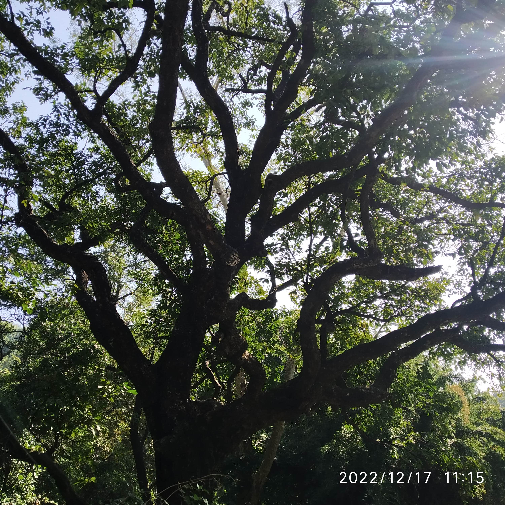
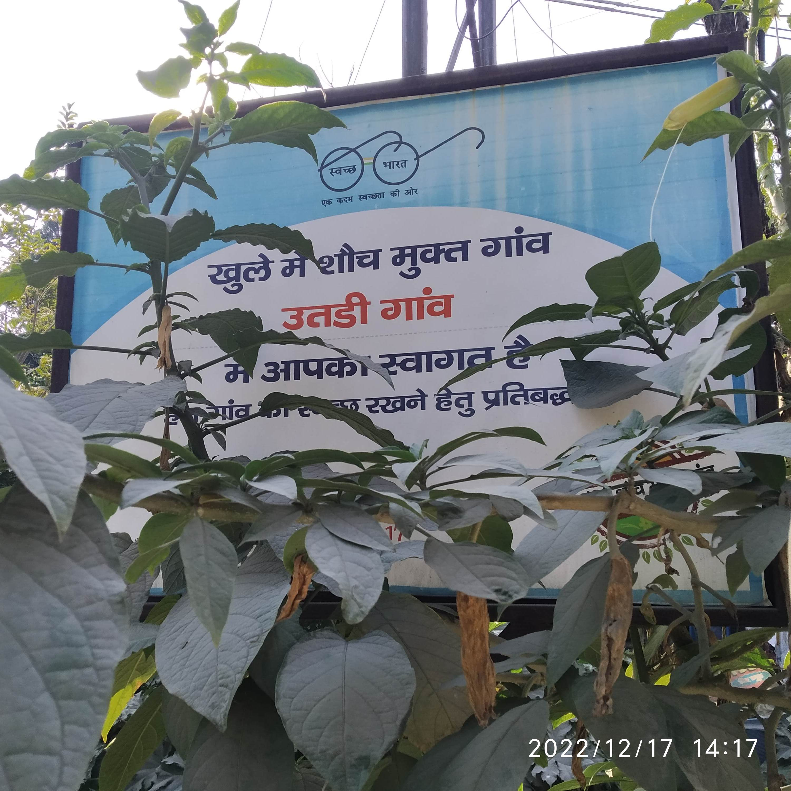

# DAY TREK Dehradun

> Trekking dissolves  boundaries, mental and physical. 

## 2022-12-17 :: Supply Depot Garhi Cantt to Kishanpur

Supply Depot - Gajiyawala - Gangol Panditwari - Gadduwala - Chaura Gaon - Bisht Gaon - Guniyal Gaon - Purkul - DIT - Mussoorie Diversion Kishanpur

## INSIGHTS 
 1. Outskirts of city are captured by very rich people for investment.
 2. Reverse migration is by rich class, not of masses.
 3. If we plan and follow, it can be a burden on body through mind. Whereas, if journey evolves, then one easily transcends mind and body. Similar to Jonathan Livingston Seagull.
 4. There is always surprise in the wild, we ate Ber, collected Amla, gaithi (air potato), Kantaki and possibly Bedu. Last one need to be confirmed. One Tirupati herbal expert friend told they eat Kantaki, will ask him sending the pic. Somehow we always end up getting Amlas.
 5. Ecological disaster in making with rampant conventional buildings in zone five on fault line.
 6. People are not living, they are trading with life. Always in great hurry for unknown destination.
 7. Walked in randomly into colorful space of Project Purkul https://www.projectpurkul.com/aboutus and had two hour long deep exchange with founder Ms Amrit Burrett, the 55 year lady with 16 years 2004-19 of Social Service job at Doon School with a very  big mission for true women empowerment with full transparency. Two A3 size Mind Maps were made instantly and sent to her for introspection and self reflection to take her unique social mission ahead as inspiration for all. She is one of founding members of AASRAA trust among others in her broad-based social service life. https://aasraatrust.org/who-we-are/the-trustees/
 8. Children of her project came out of nowhere and gifted us handmade paper craft. This is so heart touching. We shall share references such as Ten Little Figures by fellow IIT Kanpur alumnus Shri Arvind Gupta the famous toy maker. https://arvindguptatoys.com/arvindgupta/tlf120.pdf
 9. Nagar NigamToilet use charge on Mussoorie Diversion is ₹10 for women and ₹5 for men. Wondering why this disparity?
10. DIT to Kishanpur is not advisable for walk.
11. No place for Nature calls or having food in an open, clean space in cities as all spaces are monetized, pay for having food or answering Nature calls. 
12. One must walk in stretches taking (reasonable) breaks. 
13. Washing legs high up till knees or slightly more, for example  immersing legs in running stream can instantly revitalize trekkers. 
14. Exhaustion in walking in cities not in villages or hills. 
 15. Zero Budget Life is natural and healthy. 

## MAJOR TIMINGS
8:45 AM Started from home at Indirapuram behind Hotel Saffron Leaf on GMS Road.

9 AM Reached Ballupur by E-rikshaw. ₹20 for two.

9:23 AM reached Supply Depot by Magic from Ballupur. ₹40 for two.

9:41 AM Crossed Gajiyawala bridge.

Intermediate detailed timings can be seen in time stamps on pics.

7:45 PM Reached home.

## TOTAL EXPENDITURE
₹20 + ₹40 + ₹5 (toilet use by Nehal, even though asked to pay ₹10) + ₹40 = ₹105.

Total walk around  20 -25 KM. Exact stretches: 

1. Supply to Guniyal Gaon
2. Lunch at Guniyal Gaon
3. Guniyal Gaon to Purkul
4. Purkul rest during meeting for about 2 hours 
5. Purkul to Mussourie Diversion
6. Bus travel rest
7.  Lal Pul to Home 
